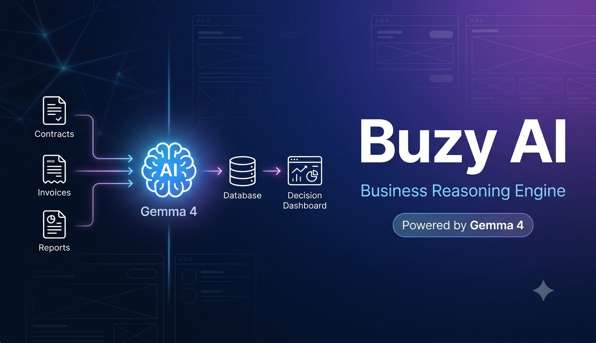
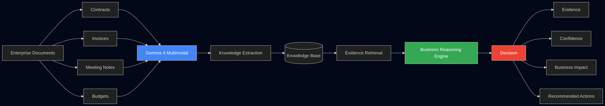
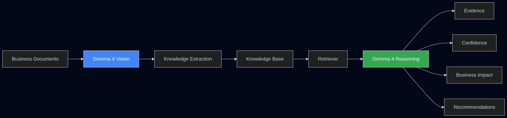
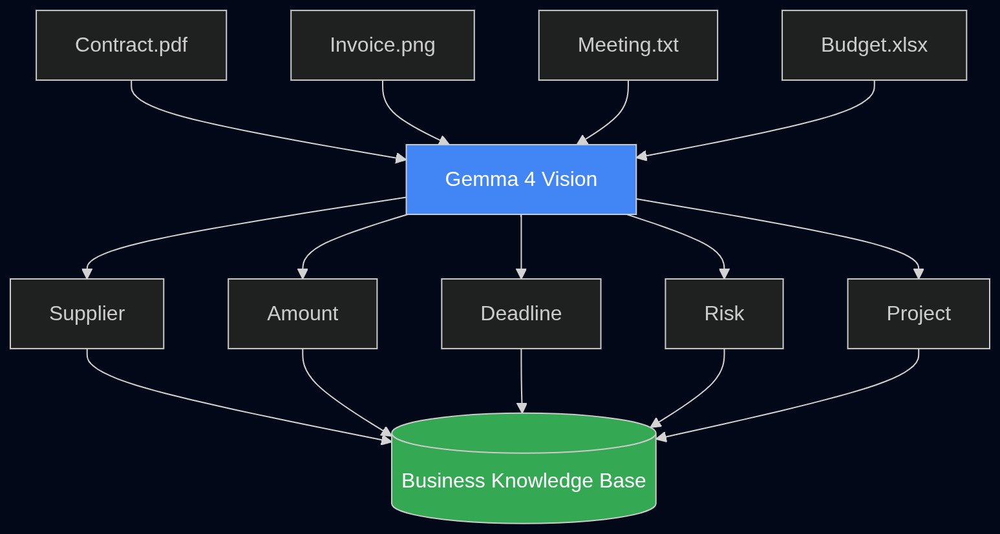
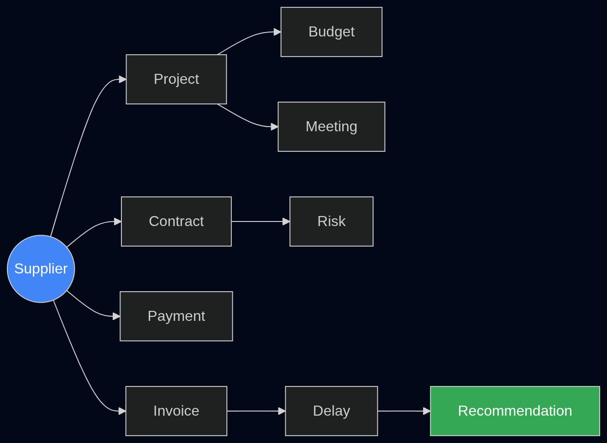
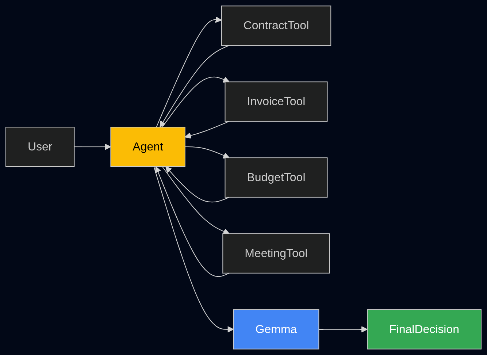
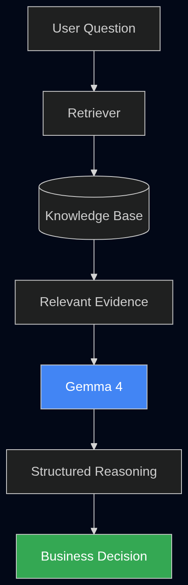

<div align="center">
  
  <h1>🧠 Buzy AI</h1>
  <p><strong>Autonomous Operating System for Organizations</strong></p>
  <p>Transform messy business documents into structured, explainable decisions — powered by Gemma 4 + LoRA.</p>

  <p>
    <a href="#-the-problem">Problem</a> •
    <a href="#-solution">Solution</a> •
    <a href="#-architecture">Architecture</a> •
    <a href="#-features">Features</a> •
    <a href="#-quickstart">Quickstart</a> •
    <a href="#-notebook">Notebook</a> •
    <a href="#-tech-stack">Tech Stack</a>
  </p>

  <br>

  <p>
    <a href="LICENSE"></a>
    <a href="https://www.kaggle.com/code/destinbir1/buzy-ai-gemma4-lora"></a>
    <a href="https://huggingface.co/DestinBir/buzy-ai-gemma4-lora"></a>
  </p>
</div>

---

## 🚨 The Problem

Enterprises produce **contracts, invoices, meeting notes, dashboards, and reports** every day — scattered across PDFs, spreadsheets, images, and audio recordings. Extracting actionable insights requires hours of manual work.

Answering questions like:
- *"Which supplier represents the highest operational risk next quarter?"*
- *"Why did the Q2 budget exceed forecast?"*
- *"Should we renew this contract?"*

…can take days of cross-referencing documents.

## 💡 Solution

**Buzy AI** is a multimodal business reasoning system that:

1. **Ingests** documents (PDF, DOCX, TXT), images (receipts, dashboards), and audio (meeting recordings)
2. **Extracts** structured facts using Gemma 4's Vision-Language capabilities
3. **Builds** a lightweight knowledge base
4. **Retrieves** relevant evidence for each business question
5. **Generates** structured, source-attributed recommendations

All powered by a **Gemma 4 model fine-tuned with LoRA** on a structured reasoning dataset.

---

## 🏗 Architecture

| Pipeline | Description |
|---|---|
|  | **End-to-end pipeline**: document ingestion → multimodal understanding → fact extraction → knowledge base → reasoning |
|  | **Business decision flow**: from raw data to structured recommendations |
|  | **Knowledge extraction**: entities, risks, financial indicators from heterogeneous docs |
|  | **Knowledge graph**: relationships between suppliers, projects, contracts, invoices |
|  | **AI agent workflow**: tool use for autonomous business queries |
|  | **Retrieval-augmented reasoning**: evidence → reasoning → confidence → actions |
|  | **LoRA fine-tuning**: efficient model adaptation |

---

## ✨ Features

### 🖥️ Gradio Web App (`app.py`)
Upload documents, images, and audio — ask a business question — get a structured Markdown report with citations.

### 📓 Kaggle Notebook (`notebooks/`)
Complete pipeline from scratch:
- **1.** Load Gemma 4 (4-bit quantized via Unsloth)
- **2.** Multimodal document understanding (Vision-Language)
- **3.** Structured fact extraction (JSON)
- **4.** Knowledge base construction (pandas)
- **5.** LoRA fine-tuning for structured reasoning
- **6.** Retrieval-augmented business reasoning
- **7.** AI agent with tool use
- **8.** Multilingual reasoning support

### 🧩 What makes Buzy AI different
- **Source-attributed outputs** — every claim cites the exact document
- **Explainable reasoning** — evidence → reasoning → confidence → impact → actions
- **Multimodal** — text, images, and audio in a single pipeline
- **LoRA-efficient** — only 0.25% of parameters trained (12.6M of 5.1B)
- **Local-first** — runs on consumer GPUs (T4, etc.)

---

## 🚀 Quickstart

### 1. Clone & install

```bash
git clone https://github.com/your-username/buzy-ai.git
cd buzy-ai
pip install -r requirements.txt
```

### 2. Run the Gradio app

```bash
python app.py
```

Open `http://localhost:7860` in your browser.

### 3. Use cases

| What to upload | Example question |
|---|---|
| 📄 Contract PDF | "What are the key obligations and risks in this contract?" |
| 🧾 Invoice image | "Summarize this invoice and flag any anomalies." |
| 🎙️ Meeting recording | "Summarize the key decisions and action items." |
| 📊 Dashboard screenshot | "What's the trend in Q2 spending by department?" |

### 4. Or use the notebook

Open [`notebooks/buzy-ai-gemma4-lora.ipynb`](notebooks/buzy-ai-gemma4-lora.ipynb) on [Kaggle](https://www.kaggle.com/code/destinbir1/buzy-ai-gemma4-lora) or locally.

---

## 📓 Notebook Highlights

The notebook (`notebooks/buzy-ai-gemma4-lora.ipynb`) walks through the full pipeline with 6 synthetic business documents from a fictional company dealing with supplier risk at **Atlas Components Ltd.**

**Scenario**: A procurement team managing:
- A contract expiring in 27 days
- Repeated late payments (18 days avg)
- Delivery instability flagged in 2 meetings
- 2 projects (Phoenix, Nova) dependent on this supplier
- An 18% Q2 budget overrun due to penalties

The model is fine-tuned on 4 structured reasoning examples using LoRA (r=8, 20 epochs) and demonstrates:
- Evidence-based answers
- Confidence scoring
- Multilingual reasoning (French)
- Tool-calling agent behavior

---

## 🛠 Tech Stack

| Layer | Technology |
|---|---|
| **Model** | [Gemma 4 (E2B-it)](https://huggingface.co/unsloth/gemma-4-E2B-it-unsloth-bnb-4bit) — 4-bit quantized |
| **Fine-tuning** | LoRA via [Unsloth](https://github.com/unslothai/unsloth) |
| **Fine-tuned weights** | [DestinBir/buzy-ai-gemma4-lora](https://huggingface.co/DestinBir/buzy-ai-gemma4-lora) |
| **App** | [Gradio](https://www.gradio.app/) |
| **ASR** | [Whisper](https://github.com/openai/whisper) (openai/whisper-small) |
| **Document parsing** | PyMuPDF, python-docx |
| **Training** | [TRL (SFTTrainer)](https://huggingface.co/docs/trl/en/sft_trainer) |
| **Platform** | Kaggle (2x T4 GPUs for training) |

---

## 📁 Project Structure

```
buzy-ai/
├── app.py                      # Gradio web application
├── requirements.txt            # Python dependencies
├── pyproject.toml              # Package metadata
├── LICENSE                     # Apache 2.0
├── .gitignore
├── notebooks/
│   └── buzy-ai-gemma4-lora.ipynb   # Full pipeline notebook
├── assets/                     # Architecture diagrams & images
│   ├── architecture.png
│   ├── business_decision_pipeline.png
│   ├── knowledge_extraction_pipeline.png
│   ├── business_knowledge_graph.png
│   ├── ai_agent_workflow.png
│   ├── retrieval_augmented_reasoning.png
│   ├── LoRa_finetuning.png
│   └── thumbnail.png
├── src/                        # Reusable Python modules
│   ├── __init__.py
│   ├── model.py                # Model loading (Gemma + LoRA)
│   ├── loaders.py              # Document/image/audio loaders
│   ├── prompt.py               # Prompt templates
│   └── inference.py            # Core inference logic
└── sample_assets/              # Example files (optional)
    └── ...
```

---

## 📊 Results

After 20 epochs of LoRA fine-tuning on 4 structured reasoning examples:

| Metric | Value |
|---|---|
| Trainable parameters | 12.6M / 5.1B (0.25%) |
| Final training loss | 0.299 |
| Training time | ~57s (2x T4) |
| LoRA rank | 8 |
| Inference device | CPU or CUDA |

The fine-tuned model consistently produces structured JSON outputs with evidence citations, reasoning chains, confidence scores, business impact assessments, and actionable recommendations.

---

## 🤝 Contributing

This project was built for the **GDG Gemma 4 Hackathon**. Contributions, issues, and feature requests are welcome!

---

## 📄 License

[Apache 2.0](LICENSE)

---

<p align="center">
  Built with ❤️ using <a href="https://ai.google.dev/gemma">Gemma 4</a> by Google<br>
  <sub>GDG Gemma 4 Hackathon 2026</sub>
</p>
